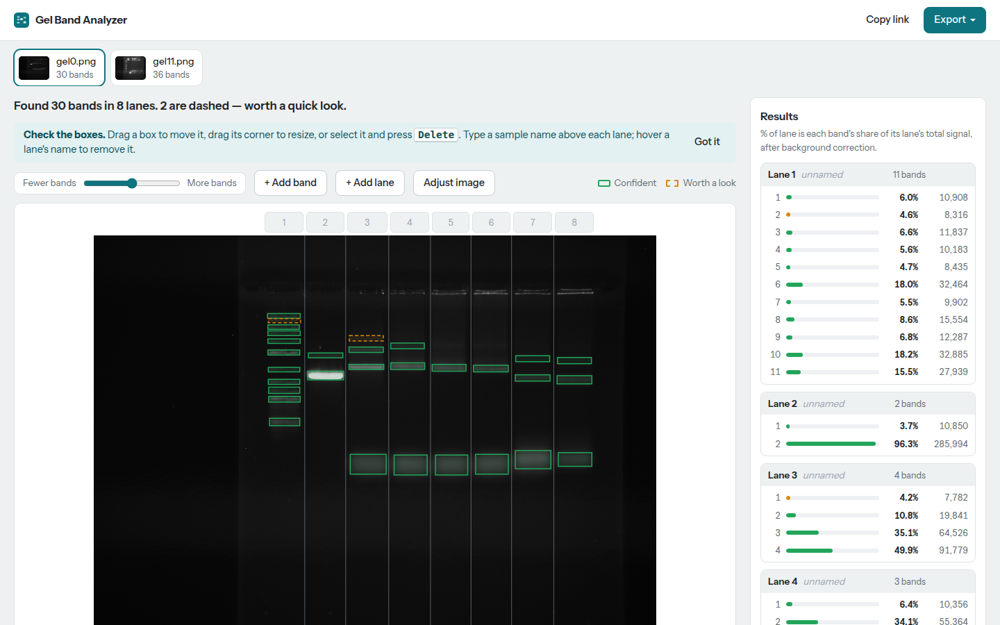

# Gel Band Analyzer

Upload a gel or western blot image and every lane and band is found and
measured for you. You check the boxes, name your samples and export a table,
an annotated image or a PDF report. No install, no manual box drawing.



## What it does

- Detects lanes and bands automatically, with a Fewer/More bands slider.
- Measures each band's background-corrected intensity and its % of the lane.
- Lets you move, resize, add and delete bands, and add, split or remove lanes.
- Estimates molecular weight from a ladder lane you mark (optional).
- Handles several gels per project, and 16-bit scanner TIFFs.
- Exports CSV, annotated PNGs and a PDF report.

It measures bands and nothing more: it never compares samples against stored
patterns to classify or diagnose them.

## How well it works

Measured end to end on hand-labelled gels from the GelGenie dataset (Dunn Lab,
University of Edinburgh), none of them used for training or tuning:

| Band F1 (each box credited with at most one band) | 50 test gels | 25 gels from five other labs |
|---|---|---|
| GelGenie, released Universal model | 0.879 | 0.664 |
| GelGenie, released Sharp Band model | 0.887 | 0.732 |
| This tool (YOLO11n detector) | **0.921** | **0.839** |

On GelGenie's ladder gels, each band's % of lane varies by about 8% across
lanes loaded with different amounts. Hand-drawn outlines vary by the same
amount, so the spread comes from the gels, not from detection.

Caveats: these are one dataset's gels and labels; the external set is small
and was used to choose between the final candidate models; the benchmark
checks where bands are, and the ladder check tests relative (% of lane)
measurement, not absolute mass. Reproduce with the scripts in
`app/training/` (`benchmark.py`, `compare_gelgenie.py`,
`quant_consistency.py`).

## Run it locally

```bash
pip install torch torchvision --index-url https://download.pytorch.org/whl/cpu
pip install -r requirements.txt
python -m app.server            # http://localhost:5000 (GEL_DEBUG=1 for the debugger)
```

Production uses gunicorn: `gunicorn --workers 1 --threads 4 app.wsgi:app`.

## Deploy to Hugging Face Spaces

1. Create a Space at huggingface.co/new-space: choose the **Docker** SDK
   (Blank template), licence `agpl-3.0`, the free CPU hardware.
2. Create an access token with write permission (Settings, Access Tokens).
3. From a clone of this repository, upload it to the Space:

   ```bash
   pip install -U huggingface_hub
   hf auth login                     # paste the write token
   hf upload <you>/<space> . . --repo-type=space --exclude ".git/*"
   ```

   Use the upload tool rather than `git push`: the Hub rejects binary files
   (the model weights, screenshots) pushed without Git LFS, and the tool
   handles them automatically. The Space then builds from the `Dockerfile`
   (about 10 minutes the first time). Run the same command to update it.
4. Optional: attach persistent storage so projects survive restarts; the app
   stores them in `/data` when it exists.

The public app caps uploads at 25 MB per image and 20 images per upload,
rate-limits each IP, and deletes projects 30 days after their last change.

## Licence and credits

Released under the GNU AGPL-3.0 (see `LICENSE`), as required by Ultralytics
YOLO. If you run a modified version as a service, you must share its source.

- Training and benchmark data: GelGenie dataset, Dunn Lab, University of
  Edinburgh, CC-BY-4.0 (Zenodo records 13218469 and 14641949); paper:
  Aquilina et al., "GelGenie: an AI-powered framework for gel electrophoresis
  image analysis", Nature Communications 16 (2025),
  https://doi.org/10.1038/s41467-025-59189-0.
- Band detector: Ultralytics YOLO11, AGPL-3.0.
- Design skills in `.claude/skills/`: Anthropic's frontend-design
  (Apache-2.0) and Leonxlnx's taste-skill (MIT).
